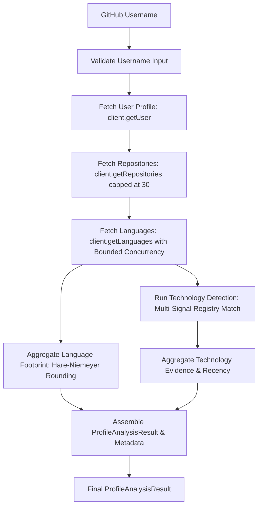

# Profile Analysis Pipeline Architecture

> Module: `src/core/pipeline/`
> Framework status: Pure TypeScript, framework-independent, 100% offline testable.

The Profile Analysis Pipeline connects the GitHub API client (Milestone 2), language footprint aggregator (Milestone 3), and technology detection engine (Milestone 4) into a unified, deterministic pipeline producing an audited `ProfileAnalysisResult`.

---

## 1. Pipeline Stages & Data Flow

1. **Input Validation**:
   - Validates that the input is non-empty, contains at most 39 characters, and conforms to GitHub's username constraints (`/^[a-zA-Z0-9](?:[a-zA-Z0-9]|-(?=[a-zA-Z0-9])){0,38}$/`).
   - Throws `PipelineInvalidUsernameError` if validation fails.
2. **User Profile Retrieval**:
   - Calls `client.getUser(username)`.
   - If the user does not exist on GitHub, raises `PipelineUserNotFoundError` (404).
3. **Repository Retrieval**:
   - Calls `client.getRepositories(username, { limit: 30, sort: 'updated', direction: 'desc', type: 'owner' })`.
   - Capped strictly at a maximum of 30 repositories.
   - If the user has zero public repositories, returns immediately with an empty language footprint, empty detected technologies, and status `"complete"`.
4. **Bounded Concurrent Language Fetching**:
   - Fetches repository language byte breakdowns via `client.getLanguages(owner, repo)`.
   - Concurrency is bounded to batches of 5 to protect GitHub API rate limits.
   - Repositories and results maintain deterministic ordering regardless of promise resolution timing.
5. **Language Footprint Calculation**:
   - Aggregates language byte counts across analyzed repositories using `aggregateLanguageFootprint`.
   - Applies the Largest-Remainder (Hare-Niemeyer / Hamilton) rounding algorithm so displayed percentages sum to **exactly 100%**.
   - Collapses overflow languages beyond the top 8 into `"Other"`.
6. **Technology Detection & Evidence Aggregation**:
   - Constructs `RepositoryDetectionInput` records from repository metadata, language bytes, and topics.
   - Matches evidence against the declarative technology registry (`detectRepositoryTechnologies`).
   - Aggregates evidence and determines evidence levels (`strong`, `moderate`, `limited`) via `aggregateDetectedTechnologies`.
   - Computes recency metrics (`mostRecentAt`, `daysSinceMostRecent`) relative to injected `now: Date`.
7. **Result Assembly**:
   - Combines the verified user profile, analyzed repositories, language footprint, detected technologies, consolidated `TechnologyProfile`, and `ProfileAnalysisMetadata`.

---

## 2. Failure Behavior & Partial Analysis Resilience

- **Nonexistent Users**: Handled as fatal errors (`PipelineUserNotFoundError`), allowing the UI to present clean 404 guidance.
- **Per-Repository Language Fetch Failure**: If an individual repository's language endpoint fails (e.g. transient 500 error or deleted repo), the pipeline records a descriptive warning in `metadata.warnings`, assigns empty language bytes to that repository, and continues analyzing the remaining repositories. The pipeline status becomes `"partial"`.
- **Mid-Analysis Rate Limiting**: If the GitHub rate limit is reached during repository language fetching, the pipeline halts further external calls, preserves all previously collected evidence, records the rate-limit warning, and returns the partial result with `status: "partial"`.

---

## 3. Core Terminology & Concept Separation

### What "Language Percentage" Means
- **Definition**: The proportion of analyzed code bytes written in a given programming language across the user's public repositories.
- **Scope**: Derived strictly from GitHub's Linguist byte telemetry.
- **Rule**: It is **never** termed "skill" or "expertise". It reflects volume of public code output, not developer proficiency.

### What "Technology Evidence" Means
- **Definition**: Observable, verifiable artifacts demonstrating that a technology was used in a public repository (e.g. package manifest dependencies, configuration files, language byte counts, topic tags).
- **Evidence Levels**:
  - `strong`: Confirmed across multiple repositories or by multiple distinct strong signals in a single repository.
  - `moderate`: Confirmed by at least one strong signal or multiple moderate signals (topics).
  - `limited`: Supporting signals only (e.g. filename patterns like `*.tsx` alone, or isolated topics).
- **Rule**: Evidence levels represent confidence in observable usage, **never subjective ability levels**.

### What `TechnologyProfile` Represents
`TechnologyProfile` is the consolidated domain model representing a developer's public technology footprint:
- `userId`: GitHub login.
- `analyzedAt`: Deterministic ISO timestamp derived from injected `now`.
- `repositoriesAnalyzed`: Count of repositories containing analyzable code.
- `technologies`: Array of `DetectedTechnology` items with supporting evidence summaries.
- `languageFootprint`: Array of `LanguageFootprintEntry` items with exact percentages summing to 100%.

---

## 4. Determinism Guarantees

- **Injected Time**: Injected `now: Date` parameter ensures repeatable timestamps and recency calculations.
- **Duration**: Runtime duration (`durationMs`) is diagnostic only and does not influence domain objects, scoring, or ordering.
- **Preserved Order**: Repository and language processing preserves strict order across runs.
