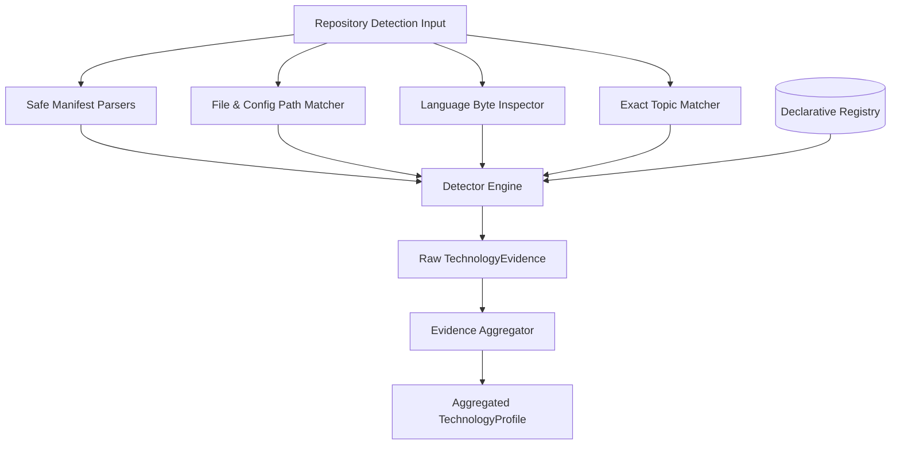

# Technology Detection Architecture

> Module: `src/core/technology/`
> Framework status: Pure TypeScript, framework-independent, 100% offline testable.

The technology detection engine is responsible for analyzing observable repository artifacts and producing an auditable, evidence-backed `TechnologyProfile`.



---

## 1. Registry Architecture

The registry (`src/core/technology/registry.ts`) is declarative and strongly typed. A technology is defined by an entry in `INITIAL_TECHNOLOGY_DEFINITIONS`:

```typescript
export interface TechnologyDefinition {
  id: string;
  name: string;
  category: TechnologyCategory;
  aliases: string[];
  signals: TechnologySignal[];
}
```

Adding a new technology (e.g. `Astro`, `Laravel`, `GraphQL`) requires adding a single definition object to the catalog. Contributors do **not** need to modify the core detection engine.

### Initial Technology Catalog (19 Curated Technologies)
- **Frontend / Web**: React, Next.js, Vue, Angular, Svelte, Tailwind CSS
- **JavaScript Ecosystem**: Node.js, Express
- **Python Ecosystem**: Python, Django, FastAPI
- **Java Ecosystem**: Java, Spring
- **Systems**: C, C++, Rust, Go
- **Infrastructure & CI**: Docker, GitHub Actions

---

## 2. Supported Signal Types & Hierarchy

Signals represent observable evidence in a repository:

| Signal Type | Description | Default Strength |
|---|---|---|
| `dependency` | Declared package in parsed manifest (`package.json`, `requirements.txt`, `pyproject.toml`, `Cargo.toml`, `go.mod`, `pom.xml`) | **Strong** |
| `configFile` | Specific configuration files (e.g. `Dockerfile`, `next.config.*`, `.github/workflows/*`, `Cargo.toml`, `go.mod`) | **Strong** |
| `language` | Direct language presence in GitHub repository language breakdown (bytes > 0) | **Strong** |
| `topic` | Exact case-insensitive repository topic/tag (e.g. `react`, `docker`, `golang`) | **Moderate** |
| `filenamePattern` | File extensions or patterns (e.g. `*.tsx`, `*.vue`, `*.svelte`, `*.rs`) | **Weak** |

---

## 3. Safe Manifest Parsers

All parsers live under `src/core/technology/parsers/` and adhere to a zero-dependency, defensive philosophy:
- **`packageJson.ts`**: Parses dependencies, devDependencies, and peerDependencies. Handles scoped packages (`@angular/core`).
- **`requirementsTxt.ts`**: Implements PEP 503 normalization (lowercase, `[-_.]+` $\rightarrow$ `-`). Strips comments, flags, extras, and version operators.
- **`pyprojectToml.ts`**: Safely extracts dependencies from PEP 621 `[project.dependencies]` and Poetry `[tool.poetry.dependencies]`.
- **`cargoToml.ts`**: Parses `[dependencies]`, `[dev-dependencies]`, `[workspace.dependencies]`, and dotted table headers (`[dependencies.tokio]`).
- **`goMod.ts`**: Extracts module paths and base package names from `require` lines and `require (...)` blocks.
- **`pomXml.ts`**: Extracts `<groupId>` and `<artifactId>` from Maven `<dependency>` blocks.

> [!NOTE]
> **Java Dependency Support**: Maven (`pom.xml`) is currently supported for Java package/dependency detection. Gradle (`build.gradle` / `build.gradle.kts`) dependency extraction is **not yet supported** in V1 and is reserved as a future enhancement. The presence of `build.gradle` / `build.gradle.kts` files is used solely as a configuration indicator of Java language code presence, not for extracting individual third-party library dependencies.

*Guaranteed Resilience*: If a file contains malformed syntax, the parser returns an empty array rather than throwing an exception.

---

## 4. Evidence Levels & Deduplication Rules

The system evaluates confidence based on verified signals, **never as a measure of developer skill**:

- **`strong`**:
  - Detected with strong signals in $\ge 2$ distinct repositories, OR
  - In a single repository, confirmed by $\ge 2$ distinct strong signal types (e.g. package dependency AND configuration file), OR
  - $\ge 1$ strong signal combined with $\ge 2$ distinct repositories containing moderate signals.
- **`moderate`**:
  - At least 1 strong signal in any repository, OR
  - At least 2 moderate signals (e.g. topics) across repositories.
- **`limited`**:
  - Only weak signals (e.g. file extensions like `*.tsx` alone), OR
  - A single isolated moderate signal (e.g. 1 topic without code or dependencies).

### Guardrail: Weak Filename Signals
Filename patterns like `*.tsx` remain strictly weak evidence. Even if present across multiple repositories, filename patterns alone **never** elevate a technology to `moderate` or `strong` evidence.

---

## 5. False-Positive Prevention

Ambiguous terms are safeguarded against accidental matches:
- **No Free-Text Scanning**: The engine never searches arbitrary README or Markdown prose.
- **No Substring Matches**:
  - The topic `"reactive"` never matches `"react"`.
  - The topic `"cargo"` or `"c-sharp"` never matches `"c"`.
  - The topic `"gopher"` never matches `"go"`.
  - The dependency `"djangorestframework"` never matches `"django"`.
- **Exact Package Matching**: All dependency comparisons require exact equality after ecosystem normalization.

---

## 6. Recency & Determinism

Recency metrics (`mostRecentAt`, `daysSinceMostRecent`) require an explicit injected `now: Date` parameter. The detector and aggregator never read `Date.now()` or `new Date()`. Given identical inputs and an identical `now` value, the engine produces byte-for-byte identical output.

---

## 7. How to Add a Technology

To add a new technology, add an entry to `INITIAL_TECHNOLOGY_DEFINITIONS` in `src/core/technology/registry.ts`:

```typescript
{
  id: "astro",
  name: "Astro",
  category: "framework",
  aliases: ["astro", "astrojs"],
  signals: [
    {
      type: "dependency",
      packageManager: "npm",
      names: ["astro"],
      strength: "strong",
    },
    {
      type: "configFile",
      patterns: ["astro.config.mjs", "astro.config.ts"],
      strength: "strong",
    },
    {
      type: "topic",
      values: ["astro", "astrojs"],
      strength: "moderate",
    },
    {
      type: "filenamePattern",
      patterns: ["*.astro"],
      strength: "weak",
    },
  ],
}
```

---

## 8. Limitations in V1
1. **Repository Scope**: In V1, analysis is bounded to the top 30 most recently updated public repositories.
2. **Structural Manifest Focus**: V1 analyzes manifest files, configuration files, language byte distributions, topics, and root file trees. It does not perform full AST analysis or code semantics across private repositories.
3. **Gradle Dependency Extraction**: While Maven `pom.xml` dependency extraction is fully implemented, Gradle (`build.gradle` / `build.gradle.kts`) third-party dependency parsing is not yet supported.
4. **Evidence Terminology**: Evidence levels reflect observable metadata in public repositories and should never be conflated with real-world developer proficiency.
